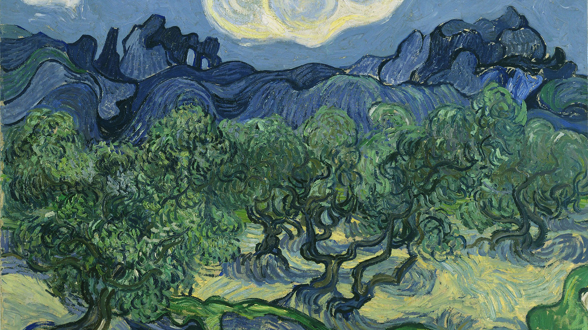
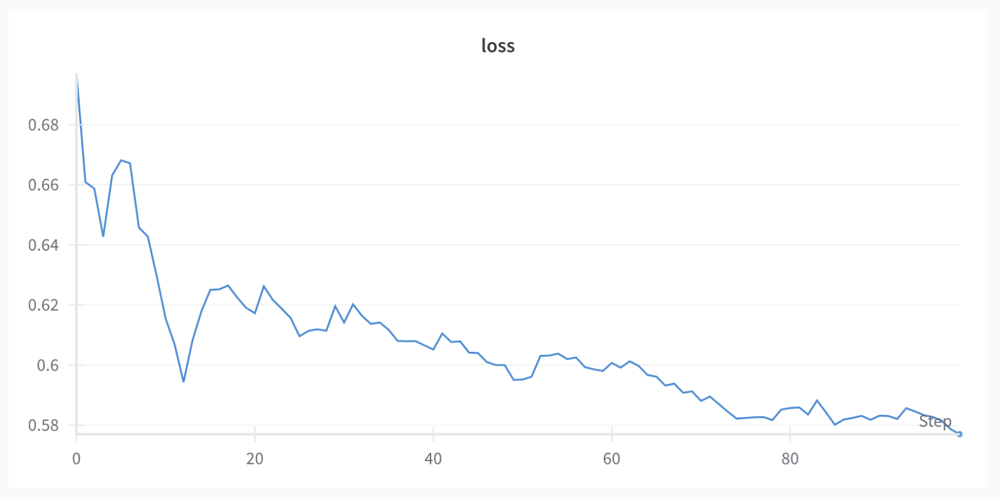
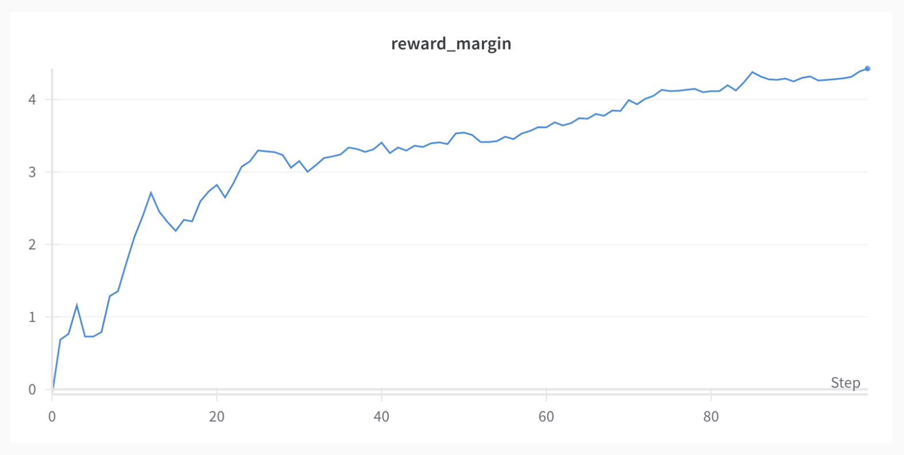

# Direct Preference Optimization


<figure markdown="span">
  { width="500" }
  <figcaption>Whether the sun rises or sets is up to our imagination.</figcaption>
</figure>


## Introduction
Training Large Language Models (LLMs) on extensive datasets in an unsupervised manner has proven highly effective in creating models capable of a wide range of tasks. These models demonstrate a significant breadth of knowledge and understanding of the world. For most applications, it’s crucial for LLMs to generate text that is contextually consistent and aligned with the intended task and user behavior. This includes developing LLMs that are safe, aligned, and unbiased, or those capable of generating syntactically and functionally correct code, despite the presence of incorrect code in the training data. However, the pre-training process alone does not guarantee specific model behavior. This is where Reinforcement Learning From Human Feedback (RLHF) becomes vital.

RLHF is a technique used to fine-tune LLMs by maximizing a reward function derived from another reward model trained on human feedback from evaluators based on a set of generated samples. This technique is widely used and is considered state-of-the-art. However, RLHF has several drawbacks that limit its effectiveness as a solution.

Direct Preference Optimization (DPO), a newly proposed technique addresses these drawbacks and offers a more robust solution. In this project, we delve into the concept of Direct Preference Optimization (DPO) as introduced in the award-winning paper at NeurIPS 2023. We will explore the process of RLHF, its limitations, and how DPO effectively overcomes these challenges. Additionally, I will provide and explain practical guides both on coding DPO from scratch in PyTorch as well as using the HuggingFace DPOTrainer API.

## GitHub Code Snippets

<b> Full Script </b> (https://github.com/mrunalmania/Direct-Preference-Optimization)

### DPO Loss Function

```python
def calculate_DPO_loss(model_prefered_logprob, model_disprefered_logprob,
                       ref_prefered_logprob, ref_disprefered_logprob,
                       beta=0.5):

    prefered_relative_logprob = model_prefered_logprob - ref_prefered_logprob
    disprefered_relative_logprob = model_disprefered_logprob - ref_disprefered_logprob

    reward_accuracies = (prefered_relative_logprob > disprefered_relative_logprob).float().mean(dim=-1)
    reward_margins = (prefered_relative_logprob - disprefered_relative_logprob).mean(dim=-1)

    loss = -F.logsigmoid(beta * (prefered_relative_logprob - disprefered_relative_logprob)).mean(dim=-1)

    return loss, reward_accuracies, reward_margins
```

We calculate the relative log probabilities by subtracting the log probabilities of the reference model from the log probabilities of the model. Then we calculate the DPO loss by taking the log sigmoid of the difference between the relative log probabilities of the human-preferred response and the human-dispreferred response. We also calculate the reward accuracies and reward margins, which are the accuracy of the model in predicting the human-preferred response over the human-dispreferred response, and the difference between the relative log probabilities of the human-preferred response and the human-dispreferred response, respectively. They are not used in the loss function, but they are useful for monitoring and logging the training process.


### DPO Train Function
```python

def train(model, ref_model, tokenizer, optimizer, train_dataloader, epochs=1, beta=0.1):
    model.train()
    ref_model.eval()

    for epoch in range(epochs):
        for batch in tqdm(train_dataloader):
            optimizer.zero_grad()

            prompt_prefered_ids = batch['prompt_prefered_ids']
            prompt_disprefered_ids = batch['prompt_disprefered_ids']
            prompt_prefered_mask = batch['prompt_prefered_mask']
            prompt_disprefered_mask = batch['prompt_disprefered_mask']

            model_prefered_log_prob = get_log_prob(model(prompt_prefered_ids,
                      attention_mask=prompt_prefered_mask).logits, prompt_prefered_ids)

            model_disprefered_log_prob = get_log_prob(model(prompt_disprefered_ids, 
                      attention_mask=prompt_disprefered_mask).logits, prompt_disprefered_ids)

            ref_prefered_log_prob = get_log_prob(ref_model(prompt_prefered_ids, 
                      attention_mask=prompt_prefered_mask).logits, prompt_prefered_ids)

            ref_disprefered_log_prob = get_log_prob(ref_model(prompt_disprefered_ids, 
                      attention_mask=prompt_disprefered_mask).logits, prompt_disprefered_ids)

            loss, prefered_relative_logprob, disprefered_relative_logprob, reward_accuracies, reward_margins = calculate_DPO_loss(
                      model_prefered_log_prob, model_disprefered_log_prob,
                      ref_prefered_log_prob, ref_disprefered_log_prob,
                      beta=beta)

            loss.backward()
            optimizer.step()
```

<b> And here we are using Microsoft Phi-2 model for alignment. </b> 

```python
tokenizer = AutoTokenizer.from_pretrained("microsoft/phi-2")
tokenizer.pad_token = tokenizer.eos_token
model = AutoModelForCausalLM.from_pretrained("microsoft/phi-2").to(device)
ref_model = AutoModelForCausalLM.from_pretrained("microsoft/phi-2").to(device)

optimizer = AdamW(model.parameters(), lr=1e-6)

dataset = load_dataset("jondurbin/truthy-dpo-v0.1", split="train")
train_dataloader = torch.utils.data.DataLoader(dataset, batch_size=4, shuffle=True,
        collate_fn=partial(collate_fn, tokenizer=tokenizer, max_length=512, device=device))

train(model, ref_model, tokenizer, optimizer, train_dataloader, epochs=1, beta=0.1)

```

## Final Results

<figure markdown="span">
  { width="600" }
  <figcaption>Loss</figcaption>
</figure>

<figure markdown="span">
  { width="600" }
  <figcaption>Rewards</figcaption>
</figure>