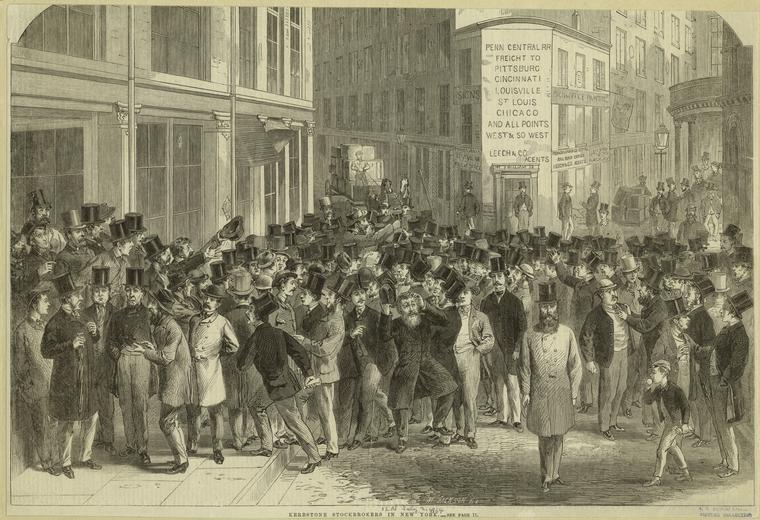

# Building a Transformer-Based Stock Prediction Model with TensorFlow

<figure markdown="span">
  { width="300" }
  <figcaption>Market fluctuations are your friend, not enemy</figcaption>
</figure>

## GitHub Repository

You can find the complete code for this project on my [GitHub repository](https://github.com/mrunalmania/Transformer-based-Stock-Prediction). Feel free to explore, contribute, or raise issues!

## Introduction

Stock market prediction is one of the most challenging tasks in financial analysis due to the market’s inherent volatility. Recently, deep learning models, particularly transformer architectures, have gained attention for their effectiveness in capturing time-series data patterns. In this blog, I will walk through how I built a stock price prediction model using a transformer architecture, the challenges I encountered, and potential future improvements.

## The Power of Transformers in Stock Prediction

Traditionally, Recurrent Neural Networks (RNNs) and Long Short-Term Memory (LSTM) networks have been used for time-series prediction. However, transformers, initially designed for Natural Language Processing (NLP), are proving to be equally powerful in capturing dependencies in sequential data, including stock prices. 

Unlike LSTMs, transformers use self-attention mechanisms to analyze long-range dependencies in the data without the need for recurrent loops, making them highly efficient for this task.

## Data Collection and Preparation

For this project, I utilized stock data from five major companies: 
- Apple (AAPL)
- Microsoft (MSFT)
- Amazon (AMZN)
- Meta (META)
- Google (GOOGL)

Using the `yfinance` library, I collected the last 30 days of stock data, sampled at 5-minute intervals. However, stock prices alone are not enough to make accurate predictions, so I incorporated technical indicators like:

- **RSI (Relative Strength Index)**
- **Bollinger Bands**
- **ROC (Rate of Change)**

These indicators helped enrich the dataset and provide more information for the model to learn from. After adding these indicators, the dataset was transformed and stored in a NumPy array, ready for training.

## The Transformer Architecture

The core of this project is the transformer model. I built a basic transformer architecture using TensorFlow, which consists of:
- **Embedding layer**: Converts the input data into a high-dimensional vector.
- **Positional Encoding**: Adds information about the order of the data points, as transformers do not process input sequentially like RNNs.
- **Self-attention layers**: The heart of the transformer, which helps the model focus on different parts of the sequence at different times.
- **Feedforward neural network**: Adds more complexity to capture intricate patterns in the data.

The model’s output predicts the direction of stock prices in the next time step based on the previous sequence.

## Challenges Faced

### 1. **LayerNormalization in TensorFlow 2.16**
One of the biggest issues I faced was with the `LayerNormalization` layer in TensorFlow 2.16, which caused some instability in the training process. After some research, I found that upgrading TensorFlow to version 2.17 solved the problem.

### 2. **Hardware Limitations**
Training deep learning models, especially transformers, can be resource-intensive. Due to limited computational power, I could only train the model for 10 epochs, which limited its performance. With better hardware, I believe the model could have performed much better.

## Results

Despite the challenges, the model performed quite well, achieving:
- **70% directional accuracy** on both training and validation sets.
- **65% overall training accuracy**.

While these results are promising, there is definitely room for improvement, especially with more epochs and a more complex architecture.

## Future Improvements

There are several areas I plan to work on next:
1. **Switching to PyTorch**: While TensorFlow is a powerful tool, PyTorch offers greater flexibility, especially for experimenting with more advanced neural network architectures. I plan to switch to PyTorch to further fine-tune the model and explore additional layers.
   
2. **Enhancing the Architecture**: The current model is fairly basic. By adding more layers and complexity to the transformer, I hope to capture more subtle patterns in the stock data and improve accuracy.

3. **Using More Data**: The model was trained on only 30 days of data, which limits its predictive capabilities. Incorporating more historical data could help the model make better predictions.

## Final Thoughts

Building a stock prediction model using transformers has been an exciting journey. While there are challenges, such as handling hardware limitations and dealing with TensorFlow quirks, the results have been promising, showing that transformers are a powerful tool for time-series forecasting.

As I continue to iterate on this project, I believe there’s potential for even greater accuracy and deeper insights. If you’re working on stock prediction or time-series analysis, transformers are definitely worth exploring.

---

**About the Author**  
I’m Mrunal Ashwinbhai Mania, a student at Arizona State University, passionate about machine learning and its applications in real-world problems. You can reach me at [mrunal29mania@outlook.com](mailto:mrunal29mania@outlook.com) for any questions or discussions.
